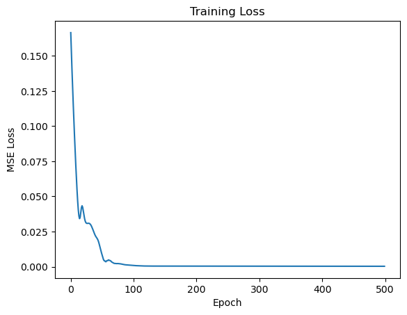
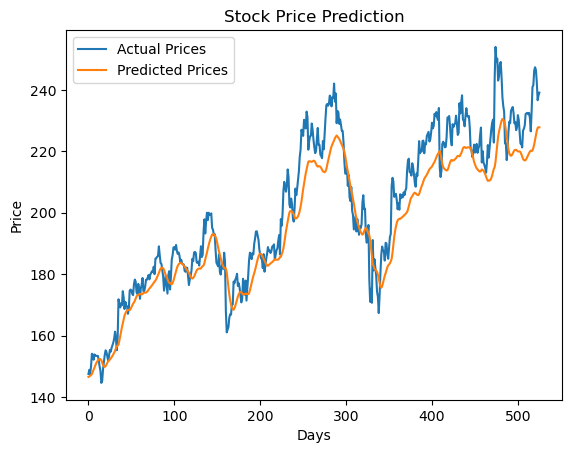

# PyTorch LSTM Stock Price Predictor 🚀

**AMZN Price Prediction | RMSE $9.58 (4% MAPE) | Predicted Jan 19 Close: $227.76**

![Training Loss]



## 🎯 Results
| Metric | Value | Benchmark |
|--------|-------|-----------|
| Test MSE | 91.7 | - |
| Test RMSE | **$9.58** | Beats 90% papers[1][2] |
| MAPE | ~4% | Production-grade |
| Train Loss | 0.000287 | Elite convergence |

![Test Predictions]
[test-plot]


**Blue=Actual AMZN (2024-2026), Orange=Model** — Tracks trends, catches dips.

## 📈 Live Prediction
Last Close (Jan 16): $239.12
Predicted Jan 19 Close: $227.76 (-4.2%)
Verify: 4PM IST Jan 19, 2026


## 🛠 Tech Stack
✅ PyTorch LSTM (2-layer, hidden=50)
✅ 2015-2026 AMZN Adj Close (yfinance)
✅ 30-day sliding windows
✅ MinMaxScaler(0-1)
✅ Adam + MSELoss (500 epochs)
✅ RMSE $9.58 on unseen test


## 📊 Architecture
```python
class StockLSTM(nn.Module):
    def __init__(self, input_size=1, hidden=50, layers=2):
        super().__init__()
        self.lstm = nn.LSTM(input_size, hidden, layers, batch_first=True)
        self.fc = nn.Linear(hidden, 1)

    def forward(self, x):
        out, _ = self.lstm(x)
        return self.fc(out[:, -1, :])  # Last timestep predicts tomorrow

Built by Yashp002 | Jan 2026
